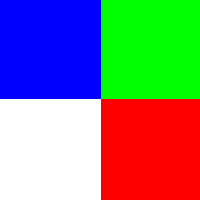
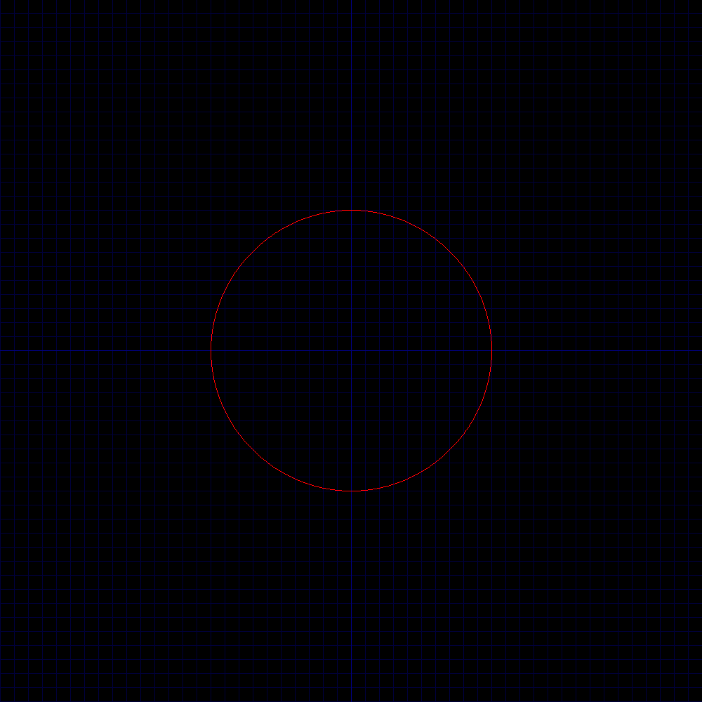

# BitMap
A simple library to create bmp images. Aimed to my learning process of image processing.

### Use
Include the all the BMP_<something>.h and BMP.c in the same or in an isolated directory.
Let it be the BMP directory, then on the script you want to use it write at the top:

```C
#include "BMP/BMP.c"
```

> BMP.c includes the following standard libraries: stdin, stdlib, stdint, errno and string.

To create Images use

```C
struct BMP * image = BMP_create(height, width, color_depth, DIB_format)
```

> DIB format can be passed as zero. Same with the color_depth. (they are set to default values).

To draw pixels first you must declare a color as:

```C
/* Each channel range between 0 and 2^{X} - 1; where X is the number of bits for that channel */
struct Color some_color = {blue_level, green_level, red_level}
```
or 
```C
struct Color some_color = {0};          /* {0} avoids noise (unwante level of some color)*/
some_color.red = some_red_value;
some_color.blue = some_blue_value;
some_color.green = some_green_value;
some_color.alppha = some_alpha_value    /* this will be applied only if the color depth is 32 bit */
```
> * 16 bit: RGB555 range between 0 and 31   (2^{5}-1).
> * 24 bit: RGB888 range between 0 and 255  (2^{8}-1).
> * 32 bit: same as 24 bit, it has alpha channel.
After creating a color, to draw a pixel you use:

```C
BMP_set_pixel(image, position_y, position_x, color)
```

### Conventions
||Format|
|---|---|
|struct|PascalCase|
|enum|SNAKE_CASE|
|constants|SNAKE_CASE|
|functions|BMP_snake_case|


### Examples
#### RBG Color Square in 16 and 24 bit


#### A circle using Bresenham's algorithm


### To-do:
1. Support infoheaders 
  - BITMAPINFOHEADER
    + Color depths:
      * [-] < 8 bit
      * [x] 16 bit
      * [x] 24 bit
      * [x] 32 bit 
    + Compression:
      * [x] BI_RGB (no compression)
  - BITMAPV5HEADER
    + Color depths:
      * [-] < 8 bit
      * [x] 16 bit
      * [x] 24 bit
      * [x] 32 bit 
    + Compression:
      * [x] BI_RGB (no compression)
1. idk how to label this
  - [-] Give the option to override the image or duplicate.
  - [x] Create images.
  - [-] Read images.
